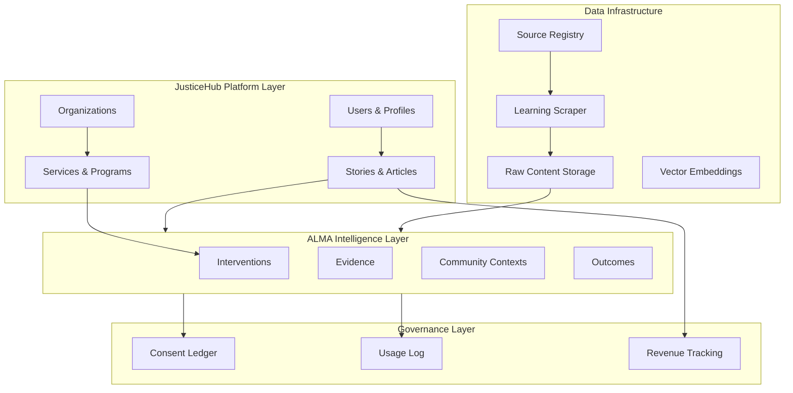

# JusticeHub Data Model - Visual Diagrams

## High-Level Architecture



## Core Entity Relationships

```
┌──────────────────────────────────────────────────────────────┐
│                    CORE PLATFORM                             │
└──────────────────────────────────────────────────────────────┘

users (id, email, role, display_name)
  │
  ├─[1:1]─→ youth_profiles (user_id, dob, interests, skills)
  │
  ├─[1:1]─→ mentor_profiles (user_id, expertise, max_mentees)
  │
  ├─[1:M]─→ stories (author_id, title, content, visibility)
  │           │
  │           ├─[1:1]─→ story_ownership (storyteller_id, consent_level)
  │           │           │
  │           │           └─[1:M]─→ story_revenue_events (amount, payment_status)
  │           │
  │           └─[1:M]─→ story_media (file_path, file_type)
  │
  ├─[1:M]─→ articles (author_id, slug, category, content)
  │
  └─[M:N]─→ organizations (via org_memberships)
              │
              ├─[1:M]─→ services (organization_id, program_type)
              │
              └─[1:M]─→ community_programs (organization_id, approach)


┌──────────────────────────────────────────────────────────────┐
│                    ALMA CORE MODEL                           │
└──────────────────────────────────────────────────────────────┘

alma_interventions (id, name, type, evidence_level, consent_level)
  │
  ├─[M:N]─→ alma_outcomes
  │         (via alma_intervention_outcomes)
  │         └─→ alma_outcomes (id, name, outcome_type, measurement)
  │
  ├─[M:N]─→ alma_evidence
  │         (via alma_intervention_evidence)
  │         └─→ alma_evidence (id, title, evidence_type, findings)
  │
  ├─[M:N]─→ alma_community_contexts
  │         (via alma_intervention_contexts)
  │         └─→ alma_community_contexts (id, name, context_type)
  │
  ├─[1:1]─→ alma_consent_ledger (entity_id, consent_level, cultural_authority)
  │
  ├─[1:M]─→ alma_usage_log (entity_id, action, user_id, revenue_generated)
  │
  ├─[1:M]─→ alma_intervention_funding (intervention_id, annual_budget, cost_benefit_ratio)
  │
  ├─[1:M]─→ alma_entity_tags (entity_id, tag_id, confidence)
  │           │
  │           └─→ alma_tags (id, category, name, parent_id)
  │
  └─[M:1]─→ services (via services.alma_intervention_id) [OPTIONAL]


┌──────────────────────────────────────────────────────────────┐
│              DATA INFRASTRUCTURE MODEL                       │
└──────────────────────────────────────────────────────────────┘

alma_source_registry (id, url, source_type, quality_score)
  │
  ├─[1:M]─→ alma_scrape_history (source_id, status, entities_found)
  │           │
  │           └─[uses]─→ alma_extraction_patterns (source_type, prompt, success_rate)
  │
  ├─[discovers]─→ alma_discovered_links (url, predicted_relevance, status)
  │
  └─[produces]─→ alma_raw_content (source_url, raw_content, file_path, file_hash)
                  │
                  ├─[1:M]─→ alma_content_entities (raw_content_id, entity_type, entity_id)
                  │           │
                  │           └─→ Points to: interventions, evidence, outcomes, contexts
                  │
                  └─[links_to]─→ alma_source_documents (url, document_type, file_path)
                                  │
                                  └─[cited_by]─→ alma_entity_sources (entity_id, source_document_id, page_numbers)
```

## ALMA Relationship Matrix

```
                    Interventions  Evidence  Outcomes  Contexts  Funding
                    ─────────────────────────────────────────────────────
Interventions       │      ─       │  M:N    │  M:N    │  M:N    │  1:M
Evidence            │     M:N      │   ─     │  M:N    │   -     │   -
Outcomes            │     M:N      │  M:N    │   ─     │   -     │   -
Contexts            │     M:N      │   -     │   -     │   ─     │   -
Funding Data        │     1:M      │   -     │   -     │   -     │   ─

Legend:
  M:N = Many-to-Many (via junction table)
  1:M = One-to-Many
  -   = No direct relationship
```

## Governance & Consent Flow

```
┌─────────────────────────────────────────────────────────┐
│          ANY ALMA ENTITY CREATED                        │
│  (intervention/evidence/outcome/context)                │
└────────────────────┬────────────────────────────────────┘
                     │
                     ▼
         ┌────────────────────────┐
         │ CHECK: consent_level?  │
         └────────┬───────────────┘
                  │
      ┌───────────┼───────────────┐
      │           │               │
      ▼           ▼               ▼
  "Public"   "Community      "Strictly
              Controlled"     Private"
      │           │               │
      │      ┌────┴────┐          │
      │      │  MUST   │          │
      │      │  HAVE   │          │
      │      │ cultural_│         │
      │      │authority│          │
      │      └────┬────┘          │
      │           │               │
      └───────────┼───────────────┘
                  │
                  ▼
      ┌─────────────────────────┐
      │ CREATE consent ledger   │
      │ - consent_level         │
      │ - cultural_authority    │
      │ - permitted_uses[]      │
      │ - contributors[]        │
      │ - revenue_share_%       │
      └────────┬────────────────┘
               │
               ▼
      ┌─────────────────────────┐
      │  ALL ACTIONS LOGGED     │
      │  in alma_usage_log:     │
      │  - query                │
      │  - view                 │
      │  - export               │
      │  - publish              │
      │  - training             │
      │  - commercial           │
      └────────┬────────────────┘
               │
               ▼
      ┌─────────────────────────┐
      │ COMMERCIAL USE?         │
      └────────┬────────────────┘
               │
          ┌────┴────┐
          │ YES     │ NO
          ▼         ▼
  ┌────────────┐  (end)
  │ Calculate  │
  │ revenue    │
  │ shares     │
  └─────┬──────┘
        │
        ▼
  ┌────────────────┐
  │ Distribute to  │
  │ contributors   │
  │ per revenue_   │
  │ share_%        │
  └────────────────┘
```

## Data Flow: Web Scraping → ALMA Entities

```
┌──────────────────────────────────────────────────────────┐
│  1. SOURCE DISCOVERY                                     │
└──────────────────────────────────────────────────────────┘

alma_source_registry (known sources)
        │
        ├─→ Government sites (aihw.gov.au, pc.gov.au)
        ├─→ Indigenous orgs (ATSILS, community councils)
        ├─→ Research (universities, think tanks)
        └─→ Media (Guardian, ABC News)

        │
        ▼
┌──────────────────────────────────────────────────────────┐
│  2. WEB SCRAPING (Firecrawl/Playwright)                 │
└──────────────────────────────────────────────────────────┘

        ↓ (HTML/PDF)
        
alma_raw_content
  - source_url
  - raw_content (text)
  - file_path (PDFs: data/pdfs/filename.pdf)
  - file_hash (SHA256 for integrity)
  - content_hash (for deduplication)

        │
        ▼
┌──────────────────────────────────────────────────────────┐
│  3. AI EXTRACTION (GPT-4)                               │
│     Uses: alma_extraction_patterns                      │
└──────────────────────────────────────────────────────────┘

        ↓ (structured JSON)

        ┌─────────────────────────────────────┐
        │   Extracted Entities:               │
        ├─────────────────────────────────────┤
        │ • Interventions (programs)          │
        │ • Evidence (research findings)      │
        │ • Outcomes (measured results)       │
        │ • Community Contexts (settings)     │
        │ • Funding Data (expenditure)        │
        └──────────┬──────────────────────────┘
                   │
                   ▼
┌──────────────────────────────────────────────────────────┐
│  4. ENTITY CREATION                                      │
└──────────────────────────────────────────────────────────┘

        ↓ (INSERT INTO)

  ┌───────────────────────────────────────────────────┐
  │  alma_interventions                               │
  │  alma_evidence                                    │
  │  alma_outcomes                                    │
  │  alma_community_contexts                          │
  │  alma_funding_data                                │
  └───────────────┬───────────────────────────────────┘
                  │
                  ├─→ TRIGGER: create consent_ledger entry
                  │
                  └─→ RECORD: alma_content_entities linkage
                      (tracks which entity came from which content)

        │
        ▼
┌──────────────────────────────────────────────────────────┐
│  5. RELATIONSHIP LINKING (Many-to-Many)                 │
└──────────────────────────────────────────────────────────┘

  alma_intervention_outcomes    (interventions ↔ outcomes)
  alma_intervention_evidence    (interventions ↔ evidence)
  alma_intervention_contexts    (interventions ↔ contexts)
  alma_evidence_outcomes        (evidence ↔ outcomes)

        │
        ▼
┌──────────────────────────────────────────────────────────┐
│  6. ENRICHMENT                                           │
└──────────────────────────────────────────────────────────┘

  • Generate embeddings (alma_embeddings)
  • Auto-tag (alma_entity_tags)
  • Link to source documents (alma_entity_sources)
  • Calculate portfolio scores

        │
        ▼
┌──────────────────────────────────────────────────────────┐
│  7. LEARNING LOOP                                        │
└──────────────────────────────────────────────────────────┘

  • Update alma_source_registry quality_score
  • Discover new links (alma_discovered_links)
  • Learn extraction patterns (success_rate)
  • Schedule next scrape (calculate_next_scrape)
```

## Hybrid Architecture: Legacy + ALMA

```
┌─────────────────────────────────────────────────────────┐
│         LEGACY JUSTICEHUB DATA                          │
└─────────────────────────────────────────────────────────┘

services (program_type, capacity, contact_info)
community_programs (approach, success_rate, participants)

        │ (optional FK)
        │ alma_intervention_id
        ▼
┌─────────────────────────────────────────────────────────┐
│              ALMA INTERVENTIONS                          │
└─────────────────────────────────────────────────────────┘

alma_interventions (evidence_level, portfolio_score, consent_level)
  │
  ├─→ enriched with evidence links
  ├─→ connected to outcomes
  ├─→ governance tracking
  └─→ cost-effectiveness data

        │
        ▼
┌─────────────────────────────────────────────────────────┐
│        UNIFIED VIEW FOR FRONTEND                         │
└─────────────────────────────────────────────────────────┘

alma_interventions_unified VIEW
  │
  ├─→ ALMA interventions (with full evidence)
  ├─→ services linked to ALMA (enriched)
  └─→ community_programs not yet linked (legacy)

Single API endpoint serves all intervention types!
```

## Search Architecture

```
┌─────────────────────────────────────────────────────────┐
│            FULL-TEXT SEARCH (PostgreSQL)                │
└─────────────────────────────────────────────────────────┘

interventions.search_vector (GIN index)
  ← setweight(to_tsvector('english', name), 'A')
  ← setweight(to_tsvector('english', description), 'B')
  ← setweight(to_tsvector('english', organization), 'C')

evidence.search_vector (GIN index)
contexts.search_vector (GIN index)
outcomes.search_vector (GIN index)

        │
        ▼
┌─────────────────────────────────────────────────────────┐
│          UNIFIED SEARCH VIEW                             │
└─────────────────────────────────────────────────────────┘

alma_unified_search
  ├─→ interventions
  ├─→ evidence
  └─→ funding

search_alma_unified(query_text, entity_types[], jurisdictions[])
  → Returns ranked results across all entities


┌─────────────────────────────────────────────────────────┐
│          SEMANTIC SEARCH (Optional)                      │
└─────────────────────────────────────────────────────────┘

alma_embeddings (embedding_data JSONB)
  ← Generated by text-embedding-3-small
  ← 1536 dimensions
  ← Stored as JSONB (no pgvector dependency)

Enables:
  • Similarity search
  • Clustering
  • "Find interventions like this"
```

## Cost-Effectiveness Analysis Model

```
┌─────────────────────────────────────────────────────────┐
│              FUNDING SOURCES                             │
└─────────────────────────────────────────────────────────┘

alma_funding_data (jurisdiction, report_year)
  │
  ├─→ total_expenditure ($1.5B national)
  ├─→ detention_expenditure (65.5% = $982.5M)
  ├─→ community_expenditure (34.5% = $517.5M)
  ├─→ cost_per_day_detention ($3,320)
  └─→ cost_per_day_community ($150)

        │ (linked to)
        ▼
┌─────────────────────────────────────────────────────────┐
│        INTERVENTION-SPECIFIC COSTS                       │
└─────────────────────────────────────────────────────────┘

alma_intervention_funding
  │
  ├─→ annual_budget
  ├─→ cost_per_participant
  ├─→ participants_per_year
  ├─→ cost_per_successful_outcome
  ├─→ cost_benefit_ratio (e.g., 3.50 = $3.50 return per $1)
  └─→ comparison_to_detention (e.g., 0.05 = 5% of detention cost)

        │
        ▼
┌─────────────────────────────────────────────────────────┐
│            SAVINGS CALCULATOR                            │
└─────────────────────────────────────────────────────────┘

calculate_potential_savings(
  young_people_diverted,
  detention_cost_per_day = 3320,
  community_cost_per_day = 150,
  avg_detention_days = 180
)

Returns:
  • detention_cost_avoided
  • community_program_cost
  • net_savings
  • savings_per_person
  • generational_multiplier (3x)
  • total_generational_impact

Example:
  100 young people diverted
  → $59.7M detention cost avoided
  → $2.7M community program cost
  → $57M net savings
  → $570K per person
  → $171M generational impact (3x multiplier)
```

## Portfolio Scoring Model

```
┌─────────────────────────────────────────────────────────┐
│      INTERVENTION PORTFOLIO SIGNALS                      │
└─────────────────────────────────────────────────────────┘

calculate_portfolio_signals(intervention_id)

Returns 5 signals (0.0 to 1.0):

1. Evidence Strength (25% weight)
   ├─→ Proven (RCT) = 1.0
   ├─→ Effective (strong eval) = 0.8
   ├─→ Indigenous-led = 0.7
   ├─→ Promising = 0.5
   └─→ Untested = 0.2
   + Boost: +0.05 per evidence record

2. Community Authority (30% weight)
   ├─→ Indigenous-led = 1.0
   ├─→ Community Controlled + authority = 0.8
   ├─→ Has cultural_authority = 0.6
   └─→ No authority = 0.3

3. Harm Risk (20% weight, inverted)
   ├─→ Low risk = 1.0
   ├─→ Medium risk = 0.6
   ├─→ High risk = 0.2
   └─→ Requires cultural review = 0.5

4. Implementation Capability (15% weight)
   ├─→ Ready (playbook available) = 1.0
   ├─→ Ready with support = 0.7
   ├─→ Community authority required = 0.6
   └─→ Not ready = 0.3
   + Boost: +0.02 per year operating

5. Option Value (10% weight)
   ├─→ Promising (learning potential) = 1.0
   ├─→ Untested (high upside) = 0.8
   ├─→ Effective = 0.4
   └─→ Proven (known quantity) = 0.2
   + Boost: +0.2 if community-endorsed but under-evidenced

        │
        ▼
┌─────────────────────────────────────────────────────────┐
│         OVERALL PORTFOLIO SCORE                          │
└─────────────────────────────────────────────────────────┘

portfolio_score = 
  (evidence * 0.25) +
  (authority * 0.30) +
  (harm_risk * 0.20) +
  (capability * 0.15) +
  (option_value * 0.10)

Ranges from 0.00 to 1.00
Higher = Better investment opportunity
```

## Coverage & Gap Analysis

```
┌─────────────────────────────────────────────────────────┐
│         COVERAGE TRACKING                                │
└─────────────────────────────────────────────────────────┘

alma_coverage_metrics (dimension_type, dimension_value)

Dimensions:
  • Jurisdiction (VIC, NSW, QLD, NT, SA, WA, TAS, ACT, National)
  • Topic (Detention, Diversion, Prevention, Mental Health, etc.)
  • Source Type (government, indigenous, research, media)
  • Organization

Metrics per dimension:
  ├─→ source_count (# of sources)
  ├─→ intervention_count (# of interventions)
  ├─→ evidence_count (# of evidence records)
  ├─→ coverage_score (0-100)
  ├─→ recommended_sources[] (fill gaps)
  └─→ priority_rank (1-N, where 1 = highest priority)

        │
        ▼
┌─────────────────────────────────────────────────────────┐
│         GAP IDENTIFICATION                               │
└─────────────────────────────────────────────────────────┘

Low coverage_score triggers:
  1. Add recommended_sources to alma_discovered_links
  2. Prioritize in scraping queue
  3. Alert admins to manual investigation

Example:
  NT has coverage_score = 15 (low)
  → Recommended: "NT Government Youth Justice"
  → Add to discovered_links with priority = 10
  → Schedule immediate scrape
```

