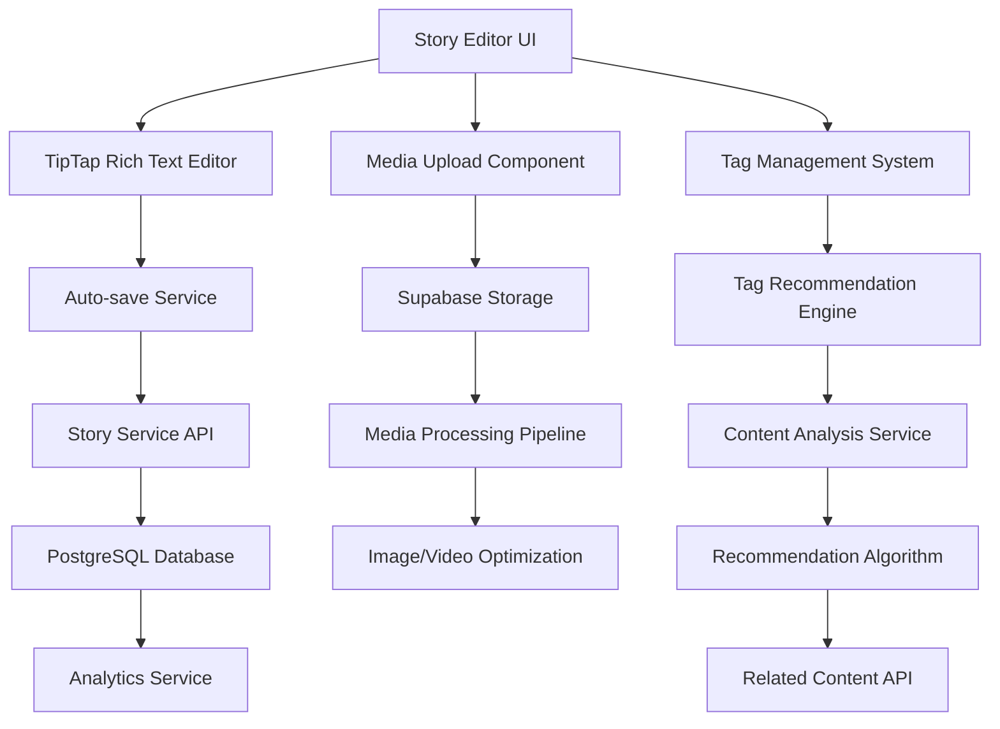

# Advanced Storytelling Features - Design Document

## Overview

The Advanced Storytelling Features will transform the current basic story creation into a comprehensive multimedia authoring experience. The design leverages modern web technologies including TipTap editor for rich text editing, Supabase Storage for media management, and intelligent recommendation algorithms for content discovery. The system is designed to be intuitive for youth users while providing professional-grade capabilities.

## Architecture

### High-Level Architecture



### Component Breakdown

1. **Rich Text Editor Layer**: TipTap-based WYSIWYG editor with custom extensions
2. **Media Management Layer**: File upload, processing, and storage management
3. **Content Intelligence Layer**: Tagging, categorization, and recommendation systems
4. **Data Persistence Layer**: Enhanced database schema for rich content
5. **Analytics Layer**: Story engagement and creation metrics

## Components and Interfaces

### 1. Rich Text Editor Component

**Technology Choice**: TipTap (ProseMirror-based) for its extensibility and React integration.

```typescript
interface RichTextEditorProps {
  initialContent?: string;
  onContentChange: (content: string, html: string) => void;
  onAutoSave: (content: string) => void;
  placeholder?: string;
  readOnly?: boolean;
}

interface EditorExtensions {
  // Core formatting
  bold: boolean;
  italic: boolean;
  underline: boolean;
  
  // Structure
  headings: [1, 2, 3];
  bulletList: boolean;
  orderedList: boolean;
  blockquote: boolean;
  
  // Media
  image: boolean;
  video: boolean;
  
  // Custom
  mediaEmbed: boolean;
  autoSave: boolean;
}
```

**Key Features**:
- Collaborative editing ready (future enhancement)
- Custom media embedding
- Auto-save with conflict resolution
- Accessibility compliant
- Mobile-responsive toolbar

### 2. Media Upload System

```typescript
interface MediaUploadService {
  uploadFile(file: File, storyId: string): Promise<MediaUploadResult>;
  processImage(file: File): Promise<ProcessedImage>;
  processVideo(file: File): Promise<ProcessedVideo>;
  generateThumbnail(videoFile: File): Promise<string>;
  validateFile(file: File): ValidationResult;
}

interface MediaUploadResult {
  id: string;
  url: string;
  thumbnailUrl?: string;
  metadata: MediaMetadata;
  processingStatus: 'pending' | 'complete' | 'failed';
}

interface MediaMetadata {
  filename: string;
  size: number;
  mimeType: string;
  dimensions?: { width: number; height: number };
  duration?: number; // for videos
}
```

**Processing Pipeline**:
1. Client-side validation and preview
2. Upload to Supabase Storage with progress tracking
3. Server-side processing (compression, thumbnail generation)
4. Database metadata storage
5. CDN distribution setup

### 3. Tag Management System

```typescript
interface TagService {
  suggestTags(content: string): Promise<TagSuggestion[]>;
  searchTags(query: string): Promise<Tag[]>;
  createTag(name: string, category?: string): Promise<Tag>;
  getPopularTags(limit?: number): Promise<Tag[]>;
  analyzeContent(content: string): Promise<ContentAnalysis>;
}

interface TagSuggestion {
  tag: Tag;
  confidence: number;
  reason: 'content_match' | 'popular' | 'related';
}

interface ContentAnalysis {
  topics: string[];
  sentiment: 'positive' | 'neutral' | 'negative';
  readingLevel: number;
  keyPhrases: string[];
}
```

**Tag Recommendation Algorithm**:
- TF-IDF analysis of story content
- Collaborative filtering based on similar stories
- Popular tags in user's organization
- Machine learning model for content classification

### 4. Story Discovery System

```typescript
interface StoryDiscoveryService {
  searchStories(query: SearchQuery): Promise<SearchResult>;
  getRelatedStories(storyId: string, limit?: number): Promise<Story[]>;
  getRecommendedStories(userId: string): Promise<Story[]>;
  getTrendingStories(timeframe: string): Promise<Story[]>;
}

interface SearchQuery {
  text?: string;
  tags?: string[];
  dateRange?: { start: Date; end: Date };
  storyType?: string[];
  authorId?: string;
  organizationId?: string;
}

interface SearchResult {
  stories: StoryPreview[];
  totalCount: number;
  facets: SearchFacets;
  suggestions?: string[];
}
```

## Data Models

### Enhanced Story Schema

```sql
-- Enhanced stories table
ALTER TABLE stories ADD COLUMN IF NOT EXISTS content_json JSONB;
ALTER TABLE stories ADD COLUMN IF NOT EXISTS content_html TEXT;
ALTER TABLE stories ADD COLUMN IF NOT EXISTS reading_time INTEGER;
ALTER TABLE stories ADD COLUMN IF NOT EXISTS word_count INTEGER;
ALTER TABLE stories ADD COLUMN IF NOT EXISTS media_count INTEGER;

-- Story media table
CREATE TABLE story_media (
  id UUID PRIMARY KEY DEFAULT gen_random_uuid(),
  story_id UUID REFERENCES stories(id) ON DELETE CASCADE,
  file_url TEXT NOT NULL,
  thumbnail_url TEXT,
  file_type VARCHAR(50) NOT NULL,
  file_size INTEGER NOT NULL,
  metadata JSONB,
  processing_status VARCHAR(20) DEFAULT 'pending',
  created_at TIMESTAMP WITH TIME ZONE DEFAULT NOW()
);

-- Enhanced tags system
CREATE TABLE tags (
  id UUID PRIMARY KEY DEFAULT gen_random_uuid(),
  name VARCHAR(100) UNIQUE NOT NULL,
  category VARCHAR(50),
  usage_count INTEGER DEFAULT 0,
  created_at TIMESTAMP WITH TIME ZONE DEFAULT NOW()
);

CREATE TABLE story_tags (
  story_id UUID REFERENCES stories(id) ON DELETE CASCADE,
  tag_id UUID REFERENCES tags(id) ON DELETE CASCADE,
  confidence FLOAT DEFAULT 1.0,
  PRIMARY KEY (story_id, tag_id)
);

-- Story analytics
CREATE TABLE story_analytics (
  id UUID PRIMARY KEY DEFAULT gen_random_uuid(),
  story_id UUID REFERENCES stories(id) ON DELETE CASCADE,
  event_type VARCHAR(50) NOT NULL, -- 'view', 'like', 'share', 'comment'
  user_id UUID REFERENCES storytellers(id),
  metadata JSONB,
  created_at TIMESTAMP WITH TIME ZONE DEFAULT NOW()
);
```

### Auto-save System

```sql
-- Auto-save drafts
CREATE TABLE story_drafts (
  id UUID PRIMARY KEY DEFAULT gen_random_uuid(),
  story_id UUID REFERENCES stories(id) ON DELETE CASCADE,
  content_json JSONB NOT NULL,
  content_html TEXT,
  version INTEGER NOT NULL,
  created_at TIMESTAMP WITH TIME ZONE DEFAULT NOW(),
  UNIQUE(story_id, version)
);
```

## Error Handling

### Client-Side Error Handling

1. **Network Errors**: Retry mechanism with exponential backoff
2. **Upload Failures**: Resume capability for large files
3. **Auto-save Conflicts**: Merge strategies with user notification
4. **Validation Errors**: Real-time feedback with clear messaging

### Server-Side Error Handling

1. **File Processing Failures**: Fallback to original file with notification
2. **Storage Quota Exceeded**: Graceful degradation with user notification
3. **Database Constraints**: Detailed error messages for tag conflicts
4. **Rate Limiting**: Queue system for media processing

## Testing Strategy

### Unit Testing
- Rich text editor component behavior
- Media upload service functions
- Tag recommendation algorithms
- Search and filtering logic

### Integration Testing
- End-to-end story creation workflow
- Media upload and processing pipeline
- Auto-save and recovery mechanisms
- Cross-browser compatibility

### Performance Testing
- Large file upload handling
- Editor performance with long content
- Search response times
- Database query optimization

### User Acceptance Testing
- Youth user story creation workflows
- Mobile device usability
- Accessibility compliance (WCAG 2.1 AA)
- Content discovery effectiveness

## Security Considerations

1. **File Upload Security**:
   - Virus scanning for uploaded files
   - File type validation on server-side
   - Size limits and rate limiting
   - Secure file storage with access controls

2. **Content Security**:
   - XSS prevention in rich text content
   - Content sanitization before storage
   - Privacy controls for story visibility
   - GDPR compliance for user data

3. **API Security**:
   - Authentication required for all endpoints
   - Rate limiting on upload endpoints
   - Input validation and sanitization
   - Audit logging for sensitive operations

## Performance Optimization

1. **Editor Performance**:
   - Lazy loading of editor extensions
   - Debounced auto-save (30-second intervals)
   - Virtual scrolling for long documents
   - Optimized re-rendering

2. **Media Optimization**:
   - Client-side image compression before upload
   - Progressive image loading
   - Video thumbnail generation
   - CDN integration for media delivery

3. **Search Performance**:
   - Full-text search indexes
   - Cached popular searches
   - Pagination for large result sets
   - Background indexing for new content

## Accessibility Features

1. **Editor Accessibility**:
   - Keyboard navigation support
   - Screen reader compatibility
   - High contrast mode support
   - Focus management

2. **Media Accessibility**:
   - Alt text for images
   - Captions for videos
   - Audio descriptions support
   - Keyboard-accessible media controls

## Future Enhancements

1. **Collaborative Editing**: Real-time collaboration using WebSockets
2. **Voice-to-Text**: Speech recognition for story creation
3. **AI Writing Assistant**: Content suggestions and grammar checking
4. **Advanced Analytics**: Heat maps and engagement insights
5. **Export Options**: PDF, EPUB, and social media formats