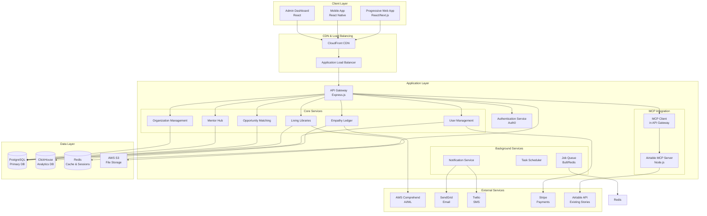
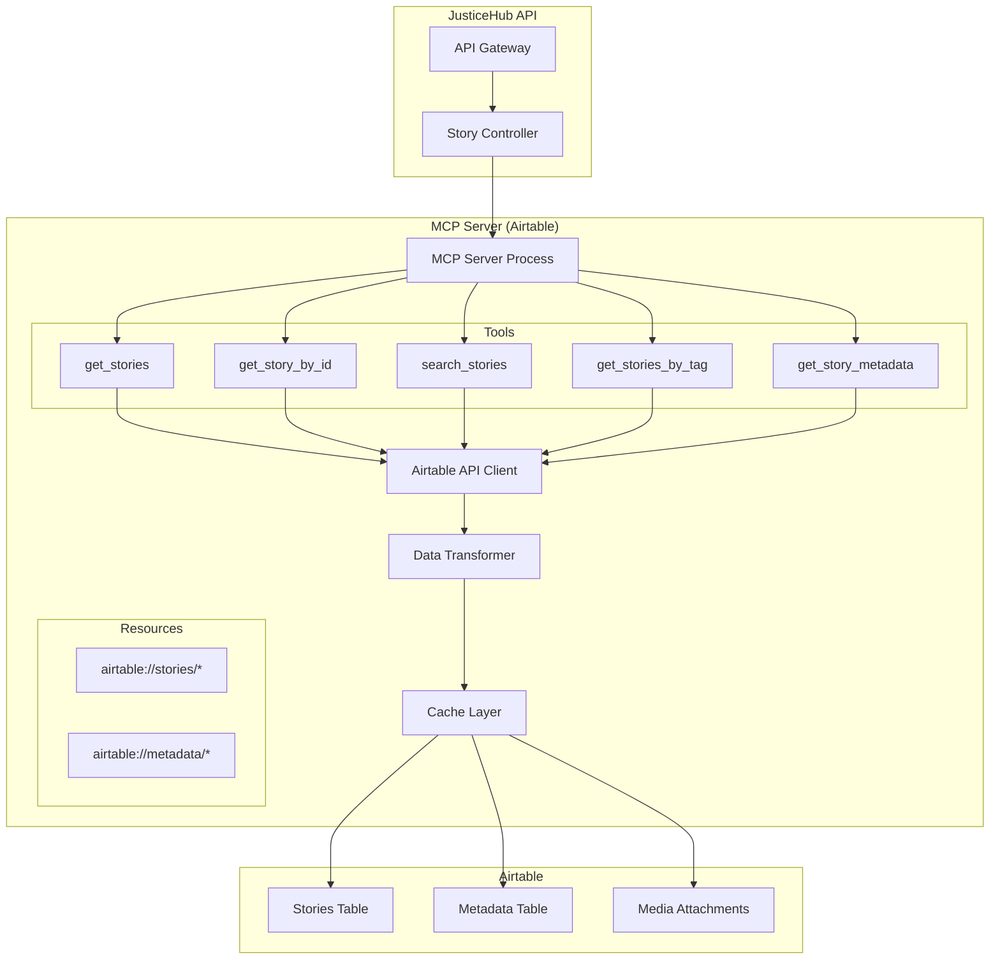
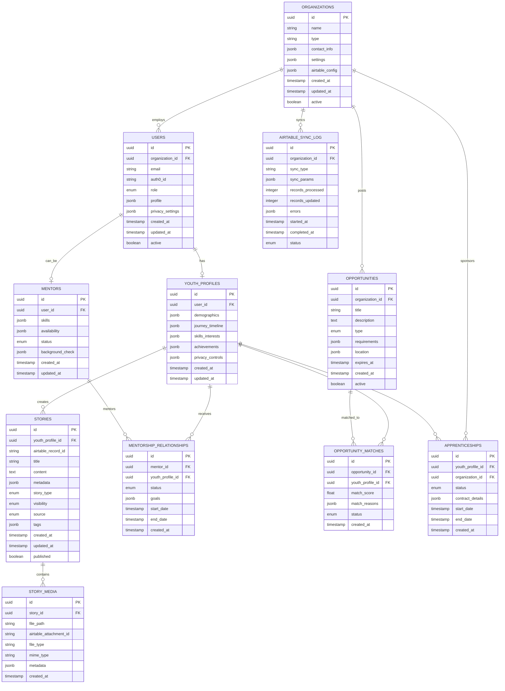
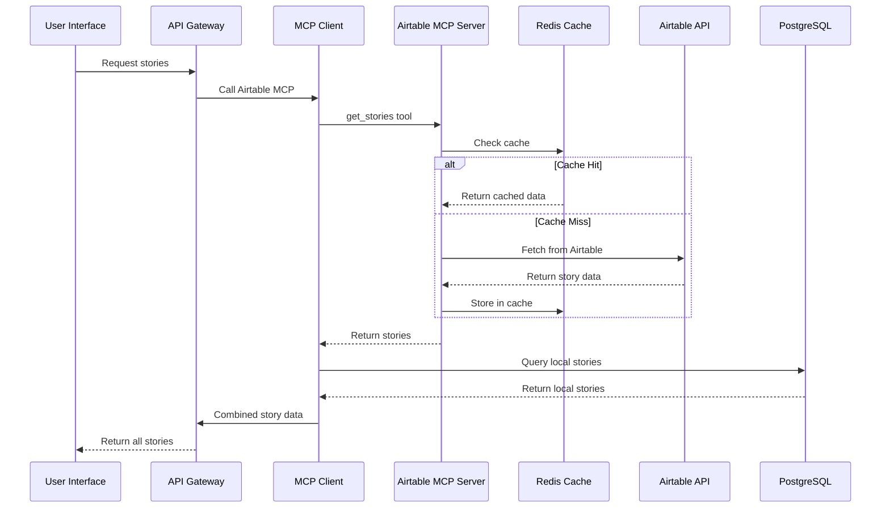
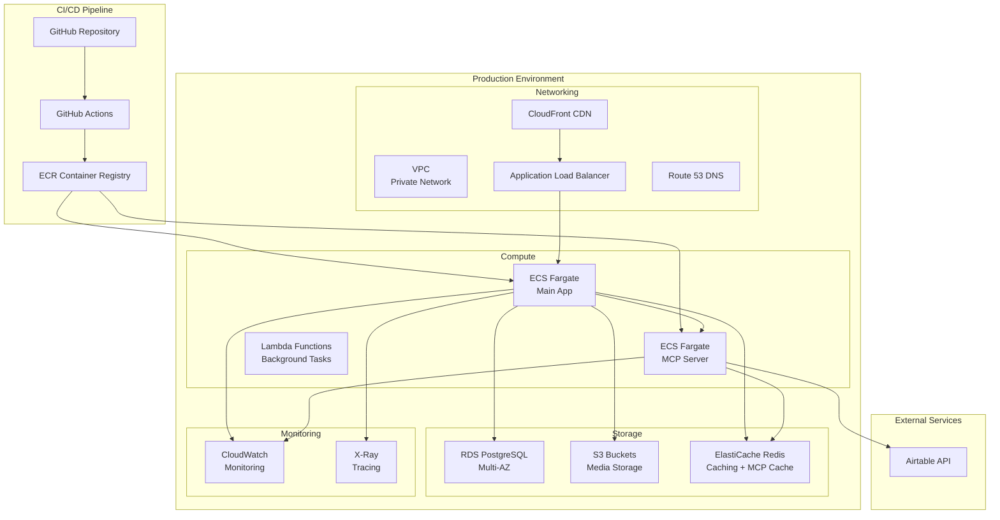
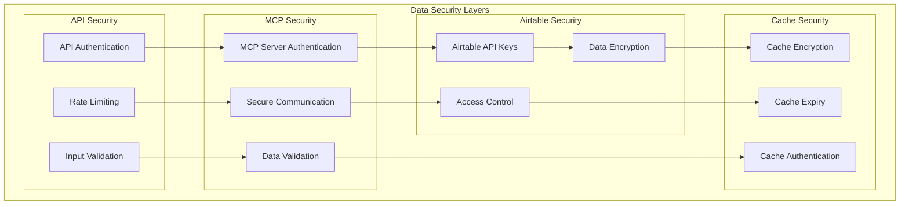
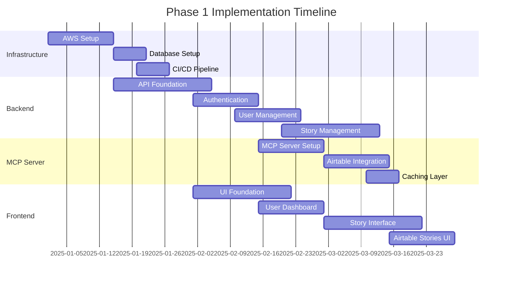
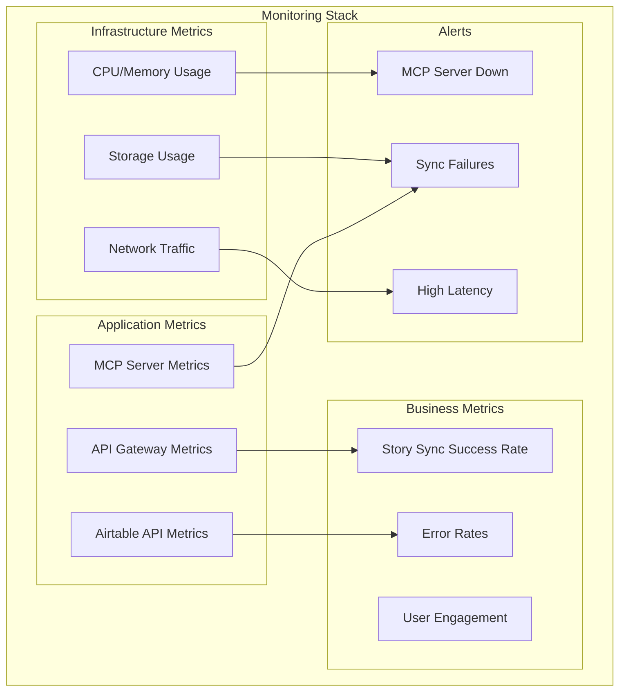

# JusticeHub Platform - Technical Architecture Plan

## 1. System Architecture Overview

### High-Level Architecture Pattern
**Microservices-Ready Monolith with MCP Integration**
- Start with a well-structured monolithic application for faster development and easier debugging
- Design with clear service boundaries to enable future microservices extraction
- Use domain-driven design principles to organize code modules
- Integrate Model Context Protocol (MCP) server for Airtable data access

### Architecture Diagram



## 2. MCP Server Architecture for Airtable Integration

### MCP Server Design



### MCP Server Tools

```typescript
// MCP Server Tool Definitions
interface AirtableMCPTools {
  get_stories: {
    description: "Retrieve stories from Airtable with optional filters";
    inputSchema: {
      organization_id?: string;
      limit?: number;
      offset?: number;
      filters?: {
        published?: boolean;
        story_type?: string;
        tags?: string[];
        date_range?: {
          start: string;
          end: string;
        };
      };
    };
  };
  
  get_story_by_id: {
    description: "Get a specific story by Airtable record ID";
    inputSchema: {
      record_id: string;
      include_media?: boolean;
    };
  };
  
  search_stories: {
    description: "Search stories by content, title, or tags";
    inputSchema: {
      query: string;
      search_fields?: string[];
      limit?: number;
    };
  };
  
  get_stories_by_tag: {
    description: "Retrieve stories with specific tags";
    inputSchema: {
      tags: string[];
      match_all?: boolean;
      limit?: number;
    };
  };
  
  get_story_metadata: {
    description: "Get aggregated metadata about stories";
    inputSchema: {
      organization_id?: string;
    };
  };
}
```

### MCP Server Resources

```typescript
// MCP Server Resource Definitions
interface AirtableMCPResources {
  "airtable://stories/all": {
    description: "All published stories";
    mimeType: "application/json";
  };
  
  "airtable://stories/recent": {
    description: "Recently published stories";
    mimeType: "application/json";
  };
  
  "airtable://stories/featured": {
    description: "Featured stories for homepage";
    mimeType: "application/json";
  };
  
  "airtable://metadata/tags": {
    description: "All available story tags";
    mimeType: "application/json";
  };
  
  "airtable://metadata/stats": {
    description: "Story statistics and analytics";
    mimeType: "application/json";
  };
}
```

## 3. Database Design (Updated)

### Primary Database (PostgreSQL)



## 4. API Structure (Updated)

### RESTful API Design with MCP Integration

```mermaid
graph TD
    subgraph "API Gateway"
        Gateway[Express.js Gateway<br/>Port 3000]
        MCPClient[MCP Client Integration]
    end
    
    subgraph "Authentication"
        Auth[Auth0 Middleware]
        RBAC[Role-Based Access Control]
    end
    
    subgraph "API Routes"
        UserAPI[/api/users/*]
        StoryAPI[/api/stories/*]
        AirtableAPI[/api/airtable/*]
        MentorAPI[/api/mentors/*]
        OrgAPI[/api/organizations/*]
        OpportunityAPI[/api/opportunities/*]
        AnalyticsAPI[/api/analytics/*]
        ApprenticeAPI[/api/apprenticeships/*]
    end
    
    subgraph "External MCP Server"
        AirtableMCP[Airtable MCP Server]
    end
    
    Gateway --> MCPClient
    Gateway --> Auth
    Auth --> RBAC
    RBAC --> UserAPI
    RBAC --> StoryAPI
    RBAC --> AirtableAPI
    RBAC --> MentorAPI
    RBAC --> OrgAPI
    RBAC --> OpportunityAPI
    RBAC --> AnalyticsAPI
    RBAC --> ApprenticeAPI
    
    MCPClient --> AirtableMCP
    AirtableAPI --> MCPClient
    StoryAPI --> MCPClient
```

### Key API Endpoints (Updated)

#### Airtable Integration Endpoints
```
GET    /api/airtable/stories               # Get stories from Airtable
GET    /api/airtable/stories/search        # Search Airtable stories
GET    /api/airtable/stories/:id           # Get specific Airtable story
GET    /api/airtable/stories/tags/:tag     # Get stories by tag
GET    /api/airtable/metadata              # Get Airtable metadata
POST   /api/airtable/sync                  # Trigger sync from Airtable
GET    /api/airtable/sync/status           # Get sync status
```

#### Enhanced Story Endpoints
```
GET    /api/stories                        # List user's stories + Airtable stories
GET    /api/stories/all                    # Combined view of all stories
GET    /api/stories/source/:source         # Filter by source (local/airtable)
POST   /api/stories                        # Create new story
GET    /api/stories/:id                    # Get specific story (any source)
PUT    /api/stories/:id                    # Update story (local only)
DELETE /api/stories/:id                    # Delete story (local only)
POST   /api/stories/:id/media              # Upload media (local only)
PUT    /api/stories/:id/privacy            # Update privacy settings
GET    /api/stories/:id/insights           # Get AI insights
```

## 5. MCP Server Implementation

### Airtable MCP Server Structure

```
airtable-mcp-server/
├── src/
│   ├── index.ts                # MCP server entry point
│   ├── tools/
│   │   ├── get-stories.ts      # Get stories tool
│   │   ├── search-stories.ts   # Search stories tool
│   │   ├── get-story.ts        # Get single story tool
│   │   └── get-metadata.ts     # Get metadata tool
│   ├── resources/
│   │   ├── stories.ts          # Stories resource handlers
│   │   └── metadata.ts         # Metadata resource handlers
│   ├── services/
│   │   ├── airtable-client.ts  # Airtable API client
│   │   ├── cache-service.ts    # Redis caching service
│   │   └── transformer.ts     # Data transformation service
│   ├── types/
│   │   ├── airtable.ts         # Airtable type definitions
│   │   └── mcp.ts              # MCP type definitions
│   └── utils/
│       ├── validation.ts       # Input validation
│       └── error-handling.ts   # Error handling utilities
├── package.json
├── tsconfig.json
└── README.md
```

### MCP Server Configuration

```typescript
// airtable-mcp-server/src/index.ts
import { Server } from '@modelcontextprotocol/sdk/server/index.js';
import { StdioServerTransport } from '@modelcontextprotocol/sdk/server/stdio.js';
import { 
  CallToolRequestSchema, 
  GetResourceRequestSchema,
  ListResourcesRequestSchema,
  ListToolsRequestSchema 
} from '@modelcontextprotocol/sdk/types.js';

import { AirtableClient } from './services/airtable-client.js';
import { CacheService } from './services/cache-service.js';
import { getStoriesTool } from './tools/get-stories.js';
import { searchStoriesTool } from './tools/search-stories.js';

class AirtableMCPServer {
  private server: Server;
  private airtableClient: AirtableClient;
  private cacheService: CacheService;

  constructor() {
    this.server = new Server(
      {
        name: 'airtable-stories-server',
        version: '1.0.0',
      },
      {
        capabilities: {
          tools: {},
          resources: {},
        },
      }
    );

    this.airtableClient = new AirtableClient({
      apiKey: process.env.AIRTABLE_API_KEY!,
      baseId: process.env.AIRTABLE_BASE_ID!,
    });

    this.cacheService = new CacheService({
      redis: {
        host: process.env.REDIS_HOST!,
        port: parseInt(process.env.REDIS_PORT!) || 6379,
      },
    });

    this.setupHandlers();
  }

  private setupHandlers() {
    // Tool handlers
    this.server.setRequestHandler(CallToolRequestSchema, async (request) => {
      switch (request.params.name) {
        case 'get_stories':
          return getStoriesTool(request.params.arguments, this.airtableClient, this.cacheService);
        case 'search_stories':
          return searchStoriesTool(request.params.arguments, this.airtableClient, this.cacheService);
        default:
          throw new Error(`Unknown tool: ${request.params.name}`);
      }
    });

    // Resource handlers
    this.server.setRequestHandler(GetResourceRequestSchema, async (request) => {
      const uri = request.params.uri;
      
      if (uri.startsWith('airtable://stories/')) {
        return this.handleStoriesResource(uri);
      } else if (uri.startsWith('airtable://metadata/')) {
        return this.handleMetadataResource(uri);
      }
      
      throw new Error(`Unknown resource: ${uri}`);
    });

    // List tools
    this.server.setRequestHandler(ListToolsRequestSchema, async () => {
      return {
        tools: [
          {
            name: 'get_stories',
            description: 'Retrieve stories from Airtable with optional filters',
            inputSchema: {
              type: 'object',
              properties: {
                organization_id: { type: 'string' },
                limit: { type: 'number' },
                offset: { type: 'number' },
                filters: {
                  type: 'object',
                  properties: {
                    published: { type: 'boolean' },
                    story_type: { type: 'string' },
                    tags: { type: 'array', items: { type: 'string' } },
                  },
                },
              },
            },
          },
          {
            name: 'search_stories',
            description: 'Search stories by content, title, or tags',
            inputSchema: {
              type: 'object',
              properties: {
                query: { type: 'string' },
                limit: { type: 'number' },
              },
              required: ['query'],
            },
          },
        ],
      };
    });
  }

  async run() {
    const transport = new StdioServerTransport();
    await this.server.connect(transport);
  }
}

const server = new AirtableMCPServer();
server.run().catch(console.error);
```

## 6. Data Flow Architecture

### Story Data Flow with Airtable Integration



## 7. Frontend Architecture (Updated)

### React Components for Airtable Integration

```
src/
├── components/
│   ├── common/              # Reusable UI components
│   ├── stories/
│   │   ├── StoryList.tsx    # Combined local + Airtable stories
│   │   ├── StoryCard.tsx    # Individual story display
│   │   ├── StoryFilter.tsx  # Filter by source/tags
│   │   ├── AirtableStory.tsx # Airtable-specific story component
│   │   └── LocalStory.tsx   # Local story component
│   ├── youth/               # Youth-specific components
│   ├── mentors/             # Mentor-specific components
│   ├── organizations/       # Organization components
│   └── admin/
│       ├── AirtableSync.tsx # Airtable sync management
│       └── DataSources.tsx  # Data source configuration
├── services/
│   ├── api/
│   │   ├── stories.ts       # Story API calls
│   │   ├── airtable.ts      # Airtable-specific API calls
│   │   └── sync.ts          # Sync management
│   └── mcp-client.ts        # MCP client integration
├── hooks/
│   ├── useStories.ts        # Combined stories hook
│   ├── useAirtableStories.ts # Airtable stories hook
│   └── useSync.ts           # Sync status hook
└── types/
    ├── story.ts             # Story type definitions
    └── airtable.ts          # Airtable-specific types
```

### State Management for Airtable Integration

```typescript
// Redux slice for stories with Airtable integration
interface StoriesState {
  local: {
    stories: Story[];
    loading: boolean;
    error: string | null;
  };
  airtable: {
    stories: AirtableStory[];
    loading: boolean;
    error: string | null;
    lastSync: string | null;
  };
  combined: {
    stories: CombinedStory[];
    filters: {
      source: 'all' | 'local' | 'airtable';
      tags: string[];
      published: boolean | null;
    };
  };
  sync: {
    inProgress: boolean;
    lastRun: string | null;
    status: SyncStatus;
  };
}
```

## 8. Infrastructure & Deployment (Updated)

### AWS Infrastructure with MCP Server



### Docker Configuration for MCP Server

```dockerfile
# Dockerfile for Airtable MCP Server
FROM node:18-alpine

WORKDIR /app

# Copy package files
COPY package*.json ./
RUN npm ci --only=production

# Copy source code
COPY dist/ ./dist/

# Create non-root user
RUN addgroup -g 1001 -S nodejs
RUN adduser -S mcpserver -u 1001
USER mcpserver

EXPOSE 3001

CMD ["node", "dist/index.js"]
```

```yaml
# docker-compose.yml updated for MCP server
version: '3.8'
services:
  app:
    build:
      context: .
      dockerfile: Dockerfile.app
    ports:
      - "3000:3000"
    environment:
      - NODE_ENV=development
      - DATABASE_URL=postgresql://user:pass@db:5432/justicehub
      - REDIS_URL=redis://redis:6379
      - MCP_SERVER_URL=http://mcp-server:3001
    depends_on:
      - db
      - redis
      - mcp-server
      
  mcp-server:
    build:
      context: ./airtable-mcp-server
      dockerfile: Dockerfile
    ports:
      - "3001:3001"
    environment:
      - AIRTABLE_API_KEY=${AIRTABLE_API_KEY}
      - AIRTABLE_BASE_ID=${AIRTABLE_BASE_ID}
      - REDIS_HOST=redis
      - REDIS_PORT=6379
    depends_on:
      - redis
      
  db:
    image: postgres:15
    environment:
      - POSTGRES_DB=justicehub
      - POSTGRES_USER=user
      - POSTGRES_PASSWORD=pass
    volumes:
      - postgres_data:/var/lib/postgresql/data
      
  redis:
    image: redis:7
    volumes:
      - redis_data:/data
      
volumes:
  postgres_data:
  redis_data:
```

## 9. Security & Privacy Implementation (Updated)

### Security Considerations for Airtable Integration



### Privacy Controls for Airtable Stories

```typescript
interface AirtablePrivacyConfig {
  story_visibility: {
    public: boolean;           // Can be shown to all users
    organization_only: boolean; // Only within same organization
    mentors_only: boolean;     // Only to assigned mentors
    anonymous: boolean;        // Strip identifying information
  };
  data_retention: {
    cache_ttl: number;         // How long to cache Airtable data
    sync_frequency: string;    // How often to sync from Airtable
    deletion_policy: string;   // How to handle deleted Airtable records
  };
  consent_tracking: {
    sharing_consent: boolean;  // Explicit consent for sharing
    analytics_consent: boolean; // Consent for analytics
    mentor_access: boolean;    // Consent for mentor access
  };
}
```

## 10. Implementation Phases (Updated)

### Phase 1: Core Platform + MCP Integration (Months 1-3)



**Updated Deliverables:**
- [ ] Infrastructure deployed on AWS
- [ ] User authentication and registration
- [ ] Basic Living Libraries functionality
- [ ] **Airtable MCP Server deployed and operational**
- [ ] **Integration with existing Airtable stories**
- [ ] **Combined story view (local + Airtable)**
- [ ] Youth dashboard with Airtable stories
- [ ] File upload for multimedia stories
- [ ] Basic privacy controls
- [ ] **Airtable sync management interface**

### Phase 2: Enhanced Features (Months 4-6)

**Additional Deliverables:**
- [ ] **Advanced Airtable story filtering and search**
- [ ] **Automated sync scheduling**
- [ ] **Story analytics including Airtable data**
- [ ] Mentor hub and matching system
- [ ] Basic analytics and insights
- [ ] Organization dashboard
- [ ] Opportunity matching engine
- [ ] Mobile progressive web app

### Phase 3: Advanced Platform (Months 7-12)

**Additional Deliverables:**
- [ ] **Multi-organization Airtable configurations**
- [ ] **Cross-platform story analytics**
- [ ] **Advanced data governance for Airtable integration**
- [ ] Advanced analytics dashboard
- [ ] Apprenticeship management system
- [ ] Multi-organization support
- [ ] API for external integrations
- [ ] Advanced reporting tools
- [ ] Performance optimizations

## 11. Technology Stack Summary (Updated)

### Backend Technologies
- **Runtime**: Node.js 18+
- **Framework**: Express.js
- **Database**: PostgreSQL 15
- **Analytics**: ClickHouse
- **Caching**: Redis
- **Authentication**: Auth0
- **File Storage**: AWS S3
- **MCP Server**: Node.js with MCP SDK
- **External Integration**: Airtable API

### MCP Server Technologies
- **MCP SDK**: @modelcontextprotocol/sdk
- **Transport**: Stdio/HTTP
- **Caching**: Redis
- **API Client**: Airtable.js
- **Data Transformation**: Custom TypeScript
- **Error Handling**: Custom middleware

### Frontend Technologies
- **Framework**: React 18 with Next.js 13+
- **Styling**: Tailwind CSS
- **State Management**: Redux Toolkit + React Query
- **MCP Integration**: Custom hooks and services
- **Build Tools**: Webpack/Vite
- **Testing**: Jest + React Testing Library

### Infrastructure (Updated)
- **Cloud Provider**: AWS
- **Containerization**: Docker (App + MCP Server)
- **Orchestration**: ECS Fargate
- **CDN**: CloudFront
- **Monitoring**: CloudWatch + DataDog
- **CI/CD**: GitHub Actions
- **MCP Deployment**: Separate ECS service

## 12. Monitoring and Observability

### MCP Server Monitoring



This comprehensive architecture plan now includes full integration with your existing Airtable stories through a dedicated MCP server. The system will be able to access, display, and analyze stories from both local storage and Airtable, providing a unified experience for users while maintaining the flexibility to scale and add new data sources in the future.

The MCP server acts as a secure bridge between JusticeHub and your Airtable data, with proper caching, error handling, and privacy controls to ensure optimal performance and data protection.