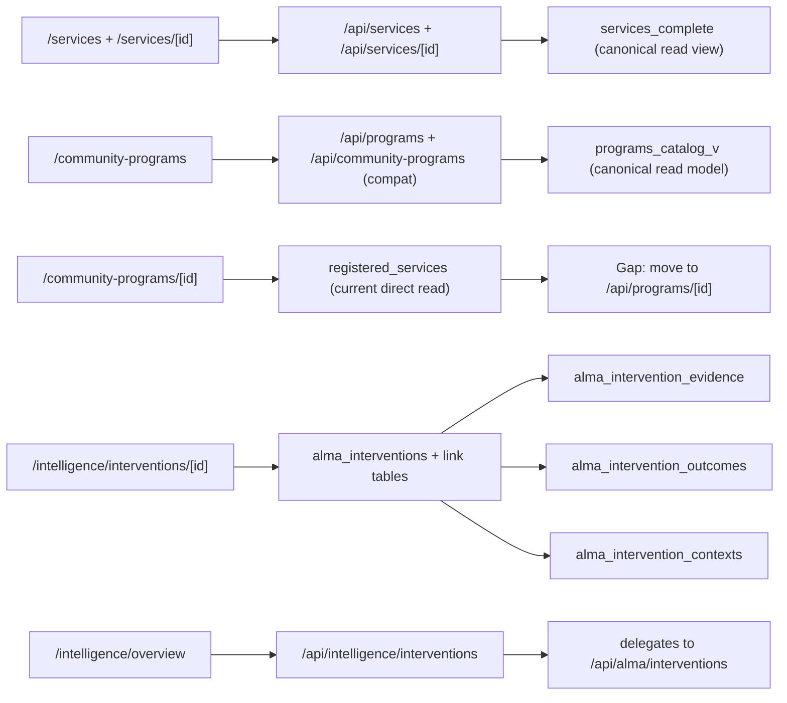
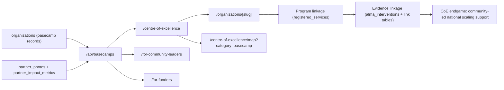

# Sprint 1 Visual Page Map

Updated: 2026-02-15

This is the visual starting point for Sprint 1 alignment: purpose -> pages -> data ownership.

## Visual Route Map (Live)

```mermaid
graph TD
  A["JusticeHub Live App"]

  A --> B["Public Core"]
  B --> B1["/"]
  B --> B2["/services"]
  B --> B3["/services/[id]"]
  B --> B4["/community-programs"]
  B --> B5["/community-programs/[id]"]
  B --> B6["/community-map"]
  B --> B7["/organizations"]
  B --> B8["/organizations/[slug]"]
  B --> B9["/stories"]
  B --> B10["/stories/[slug]"]
  B --> B11["/people"]
  B --> B12["/people/[slug]"]
  B --> B13["/search"]

  A --> C["Intelligence"]
  C --> C1["/intelligence"]
  C --> C2["/intelligence/overview"]
  C --> C3["/intelligence/interventions"]
  C --> C4["/intelligence/interventions/[id]"]
  C --> C5["/intelligence/evidence"]
  C --> C6["/intelligence/evidence/[id]"]
  C --> C7["/intelligence/funding"]
  C --> C8["/intelligence/map"]
  C --> C9["/intelligence/research"]
  C --> C10["/intelligence/dashboard"]
  C --> C11["/intelligence/status"]
  C --> C12["/intelligence/programs/[id]"]

  A --> D["Admin"]
  D --> D1["/admin"]
  D --> D2["/admin/data-operations"]
  D --> D3["/admin/data-health"]
  D --> D4["/admin/programs"]
  D --> D5["/admin/services"]
  D --> D6["/admin/research"]
  D --> D7["/admin/funding"]
  D --> D8["/admin/stories"]
  D --> D9["/admin/organizations"]
  D --> D10["/admin/profiles"]

  A --> E["Reports and Transparency"]
  E --> E1["/transparency"]
  E --> E2["/youth-justice-report"]
  E --> E3["/youth-justice-report/interventions"]
  E --> E4["/youth-justice-report/research"]
  E --> E5["/youth-justice-report/inquiries"]
```

## Data Alignment View (Core Product Paths)

## Basecamp to CoE Alignment View

## Where To See Full Inventory

- Full live page list: `/Users/benknight/Code/JusticeHub/docs/systems/LIVE_PAGES_AND_DATA_ALIGNMENT.md`
- Full live API list: `/Users/benknight/Code/JusticeHub/docs/systems/LIVE_PAGES_AND_DATA_ALIGNMENT.md`
- Runtime table usage inventory: `/Users/benknight/Code/JusticeHub/docs/systems/LIVE_PAGES_AND_DATA_ALIGNMENT.md`
