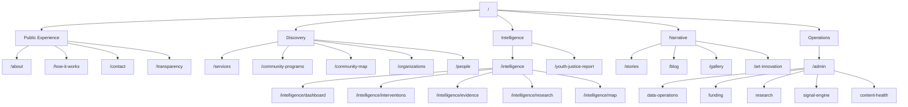
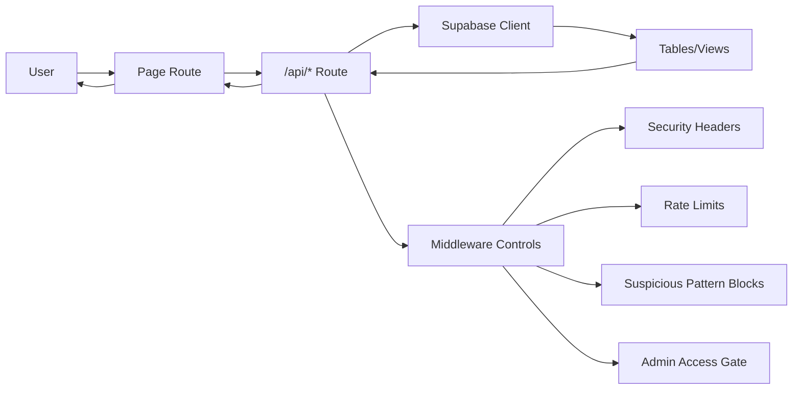
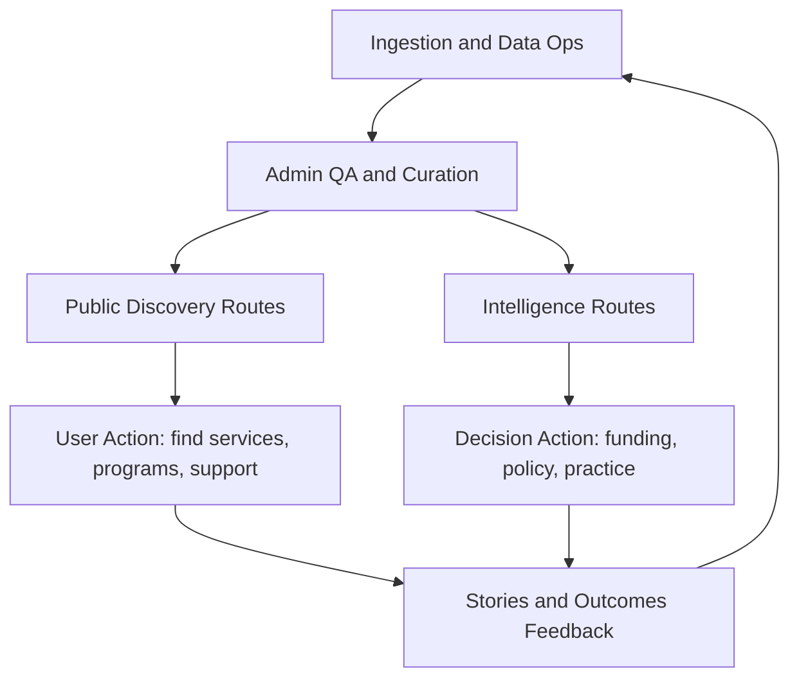
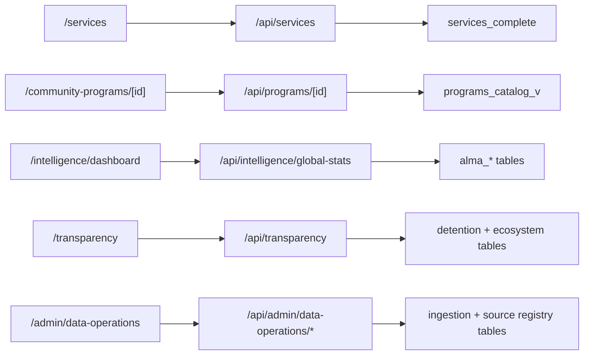

# JusticeHub Route and Process Diagrams (2026-02-25)

## 1) Route Domain Map

## 2) Request Lifecycle (Page -> API -> Data)

## 3) Operating Loop (Content + Evidence + Action)

## 4) Key Route to API Flow Examples

