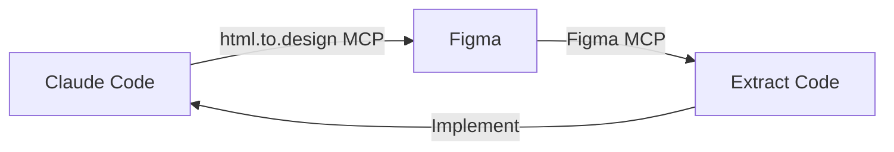

# Claude Code → Figma Workflow Guide

Complete guide for creating designs in Claude Code and importing them into Figma using the html.to.design MCP server.

---

## 🎯 Overview

This workflow enables you to:
1. **Generate UI designs** using Claude Code with Tailwind CSS
2. **Import directly to Figma** using the html.to.design MCP server
3. **Iterate and refine** designs bidirectionally between code and Figma
4. **Export back to code** using the Figma MCP server

---

## 📋 Prerequisites

### 1. MCP Servers Installed

Your `.mcp.json` should include:

```json
{
  "mcpServers": {
    "html-to-design": {
      "command": "npx",
      "args": ["-y", "@htmltodesign/mcp-server"],
      "env": {}
    }
  },
  "servers": {
    "figma": {
      "url": "https://mcp.figma.com/mcp",
      "type": "http"
    }
  }
}
```

### 2. Required Tools

- ✅ Claude Desktop or Claude Code (VSCode extension)
- ✅ Figma Desktop app (NOT web version)
- ✅ html.to.design plugin installed in Figma
- ✅ Node.js and npm installed

### 3. Figma Setup

1. Open Figma Desktop app
2. Enable local MCP server in Preferences
3. Install the [html.to.design plugin](https://www.figma.com/community/plugin/1159123024924461424/html-to-design)

---

## 🚀 Workflow Methods

### **Method 1: Direct MCP Import** (Recommended - Fastest)

#### Step 1: Generate HTML Design in Claude Code

```bash
# In Claude Code, request:
"Create an enhanced wiki article page with:
- Left sidebar navigation with search
- Main content area with breadcrumbs and article content
- Right sidebar with table of contents
- Reading progress bar at top
- Floating back-to-top button
- Dark mode toggle
- Related articles section at bottom
Use Tailwind CSS. Import to Figma when ready."
```

#### Step 2: Claude Automatically Uses MCP

Claude Code will:
1. Generate the complete HTML with Tailwind CSS
2. Automatically call the `import-html` MCP tool
3. Send the design directly to your Figma canvas

#### Step 3: View in Figma

The design appears in Figma as:
- ✅ Fully editable layers with proper naming
- ✅ Auto-layout frames (if using Flexbox/Grid)
- ✅ Organized layer hierarchy
- ✅ Preserved spacing and typography

---

### **Method 2: Manual Plugin Import** (Alternative)

#### Step 1: Generate HTML File

Ask Claude Code to create an HTML file:

```bash
"Create an enhanced wiki article HTML file at public/figma-designs/wiki-design.html
with Tailwind CSS for a modern documentation page."
```

#### Step 2: Open HTML in Browser

```bash
# Using local file
open public/figma-designs/wiki-design.html

# Or serve with a local server
npx serve public/figma-designs
# Then open http://localhost:3000/wiki-design.html
```

#### Step 3: Import to Figma

In Figma Desktop:
1. Run the **html.to.design** plugin
2. Choose "Import from URL" or "Import from HTML"
3. Paste the localhost URL or the HTML code
4. Click "Import"

#### Step 4: Design Appears in Figma

The plugin converts your HTML to editable Figma layers.

---

## 🎨 What You Can Do in Figma

### After Import

1. **Edit Everything**
   - Adjust colors, spacing, typography
   - Reorganize layout structure
   - Add/remove components
   - Apply design system tokens

2. **Create Components**
   - Turn repeated elements into Figma components
   - Build design system library
   - Add variants (hover, active states)

3. **Add Interactions**
   - Create prototypes
   - Add click interactions
   - Design user flows

4. **Collaborate**
   - Share with team for feedback
   - Add comments and annotations
   - Present to stakeholders

---

## ↔️ Bidirectional Workflow

### Code → Figma → Code



### Example Complete Cycle

**Round 1: Initial Design**
```bash
# In Claude Code
"Create wiki article layout with sidebar, content, and TOC. Import to Figma."
# → Design appears in Figma
```

**Round 2: Refine in Figma**
- Adjust colors to match brand
- Tweak spacing and typography
- Add new components

**Round 3: Extract Back to Code**
```bash
# In Claude Code with Figma MCP
"Extract the design from Figma file XYZ, node 123:456 and generate React components
with Tailwind CSS"
# → Claude reads Figma design and generates production code
```

---

## 📁 Enhanced Wiki Design Features

### ✅ What's Included in the Example

The `enhanced-wiki-article.html` file includes:

#### Left Sidebar
- Logo and wiki title
- Search bar with icon
- Collapsible navigation sections
- Active state indicators
- Footer with back link

#### Main Content Area
- Breadcrumb navigation
- Article header with title
- Meta information (reading time, last updated, views)
- Rich content with:
  - Custom typography styles
  - Tables with alternating rows
  - Blockquotes with styling
  - Lists with proper spacing
  - Code blocks
- Action buttons (share, print)
- Related articles grid

#### Right Sidebar (Table of Contents)
- Auto-generated TOC links
- Active section highlighting
- Quick action buttons (PDF, bookmark, copy link)
- Contributors section

#### Floating Elements
- Reading progress bar (top)
- Back to top button (bottom right)
- Dark mode toggle (bottom right)

---

## 🔧 Advanced Usage

### Custom Prompts for Different Designs

#### For Homepage Designs
```bash
"Create a modern homepage layout with:
- Hero section with CTA
- Feature cards grid
- Statistics section
- Testimonials carousel
- Footer with newsletter signup
Use Tailwind CSS and import to Figma."
```

#### For Dashboard Designs
```bash
"Create an admin dashboard with:
- Top navigation bar
- Left sidebar menu
- Main content with data cards
- Charts and graphs placeholders
- Right panel for notifications
Use Tailwind CSS and import to Figma."
```

#### For Mobile-First Designs
```bash
"Create a mobile-first article reader with:
- Sticky header with back button
- Collapsible table of contents
- Optimized typography for small screens
- Bottom navigation bar
Include responsive breakpoints. Import to Figma."
```

---

## 🎯 Best Practices

### For Best Figma Import Results

1. **Use Semantic HTML**
   - Proper heading hierarchy (h1, h2, h3)
   - Semantic tags (article, aside, nav, section)
   - Meaningful class names

2. **Use Tailwind Utility Classes**
   - Better than custom CSS for layer naming
   - Each utility creates proper Figma layer properties
   - Easier to edit in Figma

3. **Use Flexbox and Grid**
   - Automatically converts to Figma auto-layout
   - Maintains responsive behavior
   - Proper spacing with gap utilities

4. **Include Icons**
   - Use inline SVG for best results
   - Or reference icon libraries (Heroicons, Lucide)
   - Icons become editable vector layers in Figma

5. **Keep Layouts Simple**
   - Avoid overly complex nesting
   - Use clear section divisions
   - Limit absolute positioning

### Design System Integration

```bash
# Create design system components first
"Create a design system starter kit with:
- Color palette (primary, secondary, neutral, semantic)
- Typography scale (headings, body, captions)
- Button variants (primary, secondary, outline, ghost)
- Input components (text, select, checkbox, radio)
- Card components (basic, image, action)
Import to Figma and create component library."
```

---

## 🐛 Troubleshooting

### MCP Server Not Working

```bash
# Check MCP configuration
cat .mcp.json

# Restart Claude Code/Desktop
# The html.to.design MCP should auto-install on first use

# Test manually
npx @htmltodesign/mcp-server
```

### Import Not Appearing in Figma

1. **Check Figma Desktop is running** (not web)
2. **Verify html.to.design plugin is installed**
3. **Try manual plugin import** as fallback
4. **Check HTML validity** (no syntax errors)

### Styling Not Preserved

- ✅ Use Tailwind classes (better than custom CSS)
- ✅ Use CDN Tailwind for standalone HTML files
- ✅ Avoid complex CSS animations (may not import)
- ✅ Use standard web fonts

### Auto-layout Not Applied

- Use `display: flex` or `display: grid`
- Include `gap` utilities for spacing
- Use semantic container elements

---

## 📊 Comparison: Methods

| Feature | MCP Direct Import | Manual Plugin Import |
|---------|------------------|---------------------|
| Speed | ⚡ Fastest (instant) | 🐢 Slower (manual steps) |
| Automation | ✅ Fully automated | ❌ Manual copy/paste |
| Iteration | ✅ Easy (just re-prompt) | ⚠️ Requires file updates |
| Setup | ⚠️ Requires MCP config | ✅ Just plugin install |
| Flexibility | ✅ High (code → design) | ✅ High (any HTML source) |

---

## 🎓 Learning Resources

### Official Documentation
- [html.to.design MCP Docs](https://html.to.design/docs/mcp-tab/)
- [Figma MCP Server Docs](https://www.figma.com/developers/docs/)
- [Model Context Protocol](https://modelcontextprotocol.io/)

### Example Prompts Library

Save these in `.claude/commands/` for quick access:

**`.claude/commands/wiki-design.md`**
```markdown
Create an enhanced wiki article page design with modern features and import to Figma.

Include:
- Left sidebar with navigation and search
- Main content area with article content
- Right sidebar with table of contents
- Reading progress bar
- Related articles section
- Floating action buttons

Use Tailwind CSS and send to Figma when ready.
```

---

## ✅ Success Checklist

Before importing to Figma, verify:

- [ ] HTML is valid (no syntax errors)
- [ ] Tailwind CDN is included (for standalone files)
- [ ] Design looks correct in browser preview
- [ ] Responsive breakpoints work as expected
- [ ] All images have proper paths or use placeholders
- [ ] Icons are inline SVG or from CDN
- [ ] Color scheme is consistent
- [ ] Typography hierarchy is clear

After importing to Figma:

- [ ] All layers are properly named
- [ ] Auto-layout is applied where expected
- [ ] Colors match the design
- [ ] Typography styles are correct
- [ ] Components are logically grouped
- [ ] Layout is editable and flexible

---

## 🚀 Next Steps

### Immediate Actions

1. **Test the workflow** with the example file:
   ```bash
   open public/figma-designs/enhanced-wiki-article.html
   ```

2. **Import to Figma** using html.to.design plugin

3. **Experiment with variations**:
   - Try different color schemes
   - Add more sections
   - Create mobile versions

### Production Workflow

1. **Create design components** in Figma from imports
2. **Build design system** with tokens and styles
3. **Generate production code** from Figma using Figma MCP
4. **Implement in your codebase** as React/Next.js components

### Advanced Patterns

1. **Automate design generation** for multiple pages
2. **Create design system scripts** that generate components
3. **Build design → code pipelines** for rapid iteration

---

## 📝 Example Session

Here's a complete example session in Claude Code:

```bash
User: "Create a modern wiki article design and import to Figma"

Claude: "I'll create an enhanced wiki article layout with modern features
and import it to Figma using the html.to.design MCP.

Creating design with:
- Left sidebar navigation with search
- Main content with rich formatting
- Right sidebar with table of contents
- Progress bar and floating actions

[Generates HTML with Tailwind CSS]

Now importing to Figma..."

[Uses mcp__html_to_design__import_html MCP tool]

Claude: "✅ Design successfully imported to Figma!

The layout includes:
- Complete navigation system
- Article content with typography
- Table of contents sidebar
- Interactive elements

You can now:
1. Open Figma Desktop to view the design
2. Edit colors, spacing, and layout
3. Create components from repeated elements
4. Add prototyping interactions

Would you like me to create variations or export any part back to React code?"
```

---

## 🎉 Summary

You now have a complete workflow for:
- ✅ Generating UI designs with Claude Code
- ✅ Importing them to Figma (MCP or plugin)
- ✅ Refining designs in Figma
- ✅ Extracting back to code
- ✅ Iterating quickly between code and design

**Next**: Try the workflow with the included `enhanced-wiki-article.html` example!

---

_Created: January 2025 | JusticeHub Design System_
